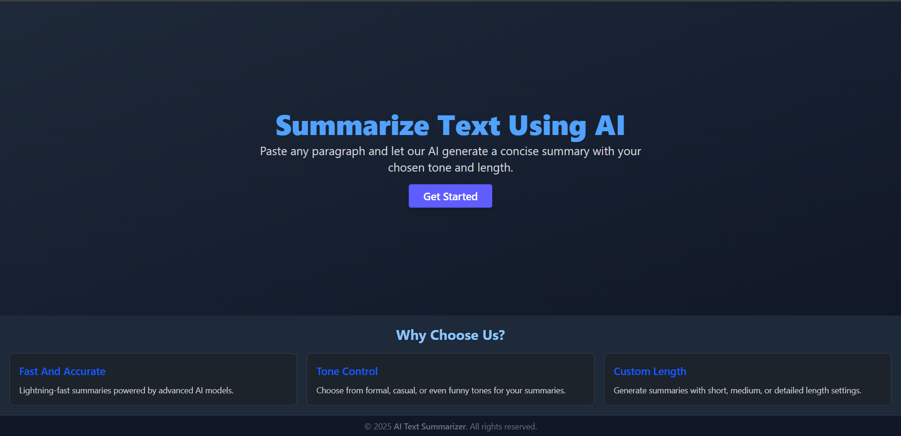
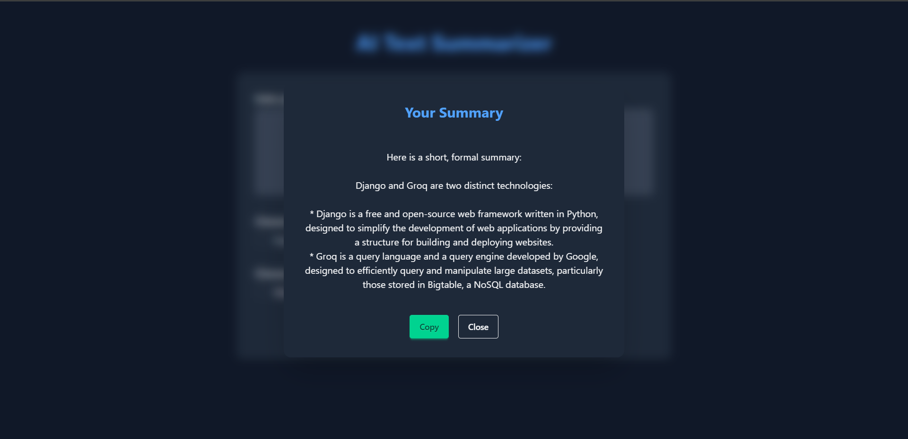

# AI Text Summarizer (Django + Tailwind)

This is a simple yet powerful AI text summarization web app built with Django. Users can input a paragraph, choose a tone and summary length, and receive an AI-generated summary via Groq's API.

---

## ✨ Features

- Summarize any input text using AI
- Choose **Tone**: Formal, Informal
- Choose **Length**: Short, Long
- Pop-up display of summary
- One-click copy summary button
- Beautiful responsive UI built with Tailwind CSS
- Secure CSRF-protected Django form handling

---

## How to Run Locally

### 1. Clone the Repository

```bash
git clone https://github.com/Dev-CodeBox/text_summarizer.git
cd text_summarizer
```

### 2. Install Dependencies

```bash
pip install -r requirements.txt
```

### 3. Set Environment Variables

Create a `.env` file and add your Groq API key:

```
GROQ_API_KEY=your_key_here
```

Or, use `os.environ.get('GROQ_API_KEY')` if set via system.

### 5. Run Tailwind

```bash
python manage.py tailwind start
```

### 6. Start the Django Server

```bash
python manage.py runserver
```

Visit: [http://127.0.0.1:8000](http://127.0.0.1:8000)

---

## Example Prompt

- **Input**: “Artificial intelligence is transforming how we live and work...”
- **Tone**: formal
- **Length**: Short
- **Output**: “AI is changing everyday life and work efficiency.”

---

## Technologies Used

- Python & Django
- Tailwind CSS
- Groq API (AI summary generation)
- Django Templates
- Vanilla JavaScript (for popup/copy)

---

## Preview

### Home Page



### Form Page (Summarize Text)


### Popup Summary Response



## Contributing

Pull requests are welcome. For major changes, please open an issue first to discuss what you would like to change.

---
